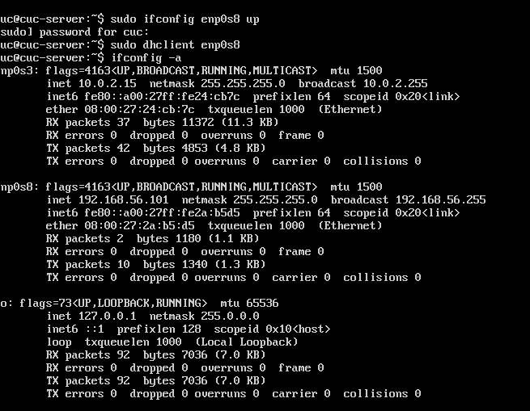
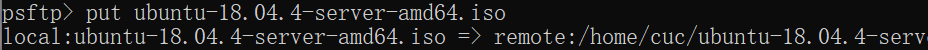
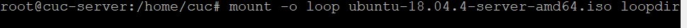
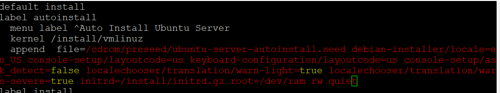
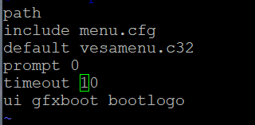
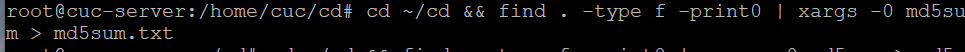
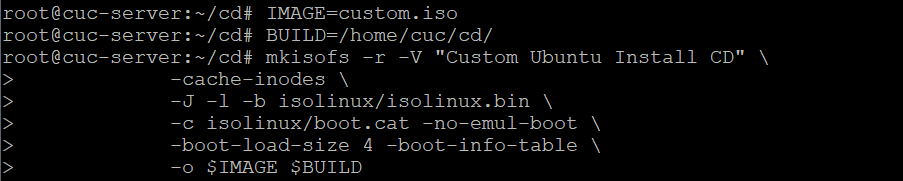

# 实验1
> 实验目的：配置无人值守安装iso并完成自动化安装。
## 安装和设置 OpenSSH Server
> 安装openssh-server
- sudo apt-get install openssh-server
> 开启服务
- sudo /etc/init.d/ssh start
> 验证是否开启
- ps -e | grep ssh
- 若出现00：00：00 sshd则代表已经启动
> 备注：没有配置公私钥配对进行快速登陆
### [参考资料](https://www.cnblogs.com/clemente/p/11348035.html)
---

## 无人值守安装
>- 下载Ubuntu-18.04.4-server-amd64.iso和老师的Ubuntu-server-autoinstall.iso两个镜像并放在putty所在目录下
>- 打开虚拟机查看网卡状态，如果未启动需要手动启动。

>- 用psftp将Ubuntu-18.04.4-server-amd64.iso镜像传入虚拟机

>- 用root权限打开目录，并新建目录

>- 挂载Ubuntu镜像

>- 创建目录并同步光盘内容

>- 卸载原始镜像

>- 编辑引导界面
 （由于换行，之前出现在选择语言之后的安装界面出现问题）

>- 将.seed文件传入虚拟机

>- 修改timeout，防止需要手动启动安装界面

>- 生成MD5文件

>- 封闭改动后的目录到.iso

>- 移出虚拟机

>### [vim强制保存并退出](https://zhidao.baidu.com/question/1383974964482632100.html)
>### [psftp传输文件](https://zhidao.baidu.com/question/131423298.html)

